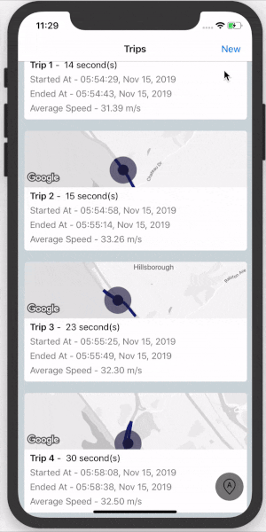

# Trips

```
If you are trying to run the project, you need a Google Maps API Key in order to see the map.
Search for `TODO` and enter your map key there.
```
### Xamarin.Forms UI challenge

 - Add a new Trip
 - Save/Discard on Trip Completion
 - View List of Trips - ListView and Clustered MapView
 - View Trip details

#### Demo


### Uses:
 - CollectionView to display list of Trips
 - A Renderer for iOS on top of - [Xamarin.Google.iOS.Maps](https://www.nuget.org/packages/Xamarin.Google.iOS.Maps/)
 - A Renderer for Cluster marker on top of - [Xamarin.Google.Maps.Utils](https://www.nuget.org/packages/Xamarin.Google.Maps.Utils/)
 - Icons by [Icons8](https://icons8.com)
